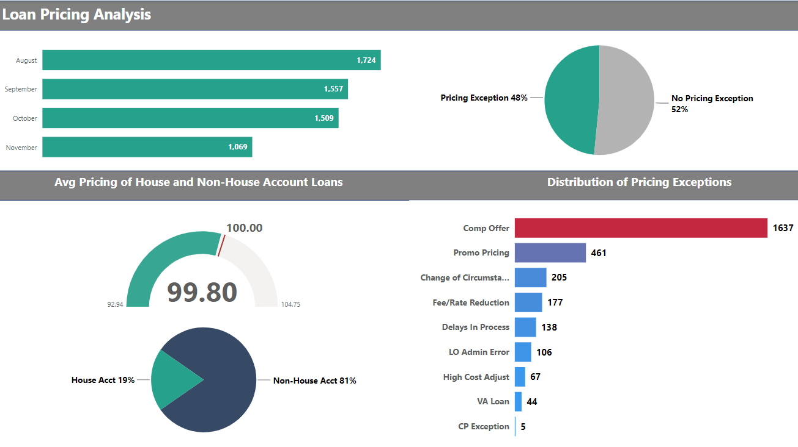
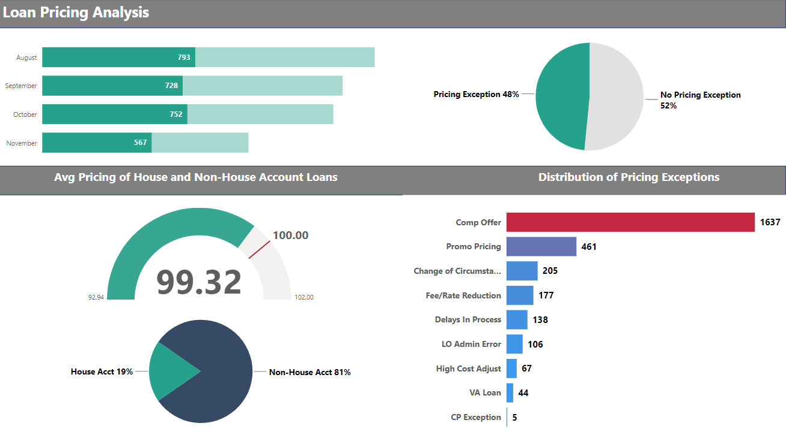
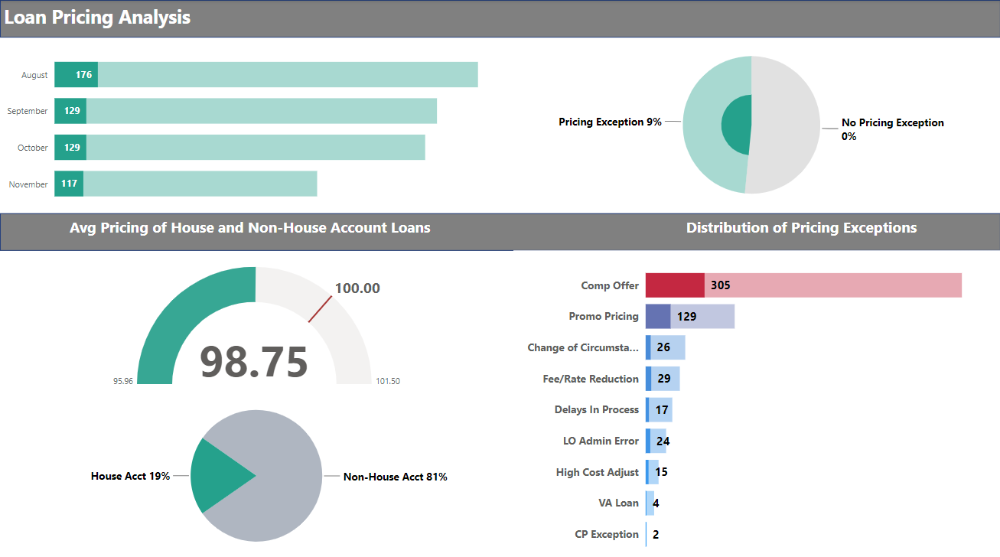

# Introduction
I was asked to pull some data and summarize loan pricing into "pie charts". I figured this exercise would be a great opportunity to do a little Power BI magic and break away from excel charts and do an interactive report that would be embedded in a slide deck. 
# Background


# Tools I Used

# Datasets

# SQL Query
The following SQL query was used to create the datasets used in this project. The challenge was to get the list of loans and the last associated pricing exception, if there was one, that was in effect with the loan at the time of origination. It is possible to have multiple pricing exceptions per loan, which is why there was the need use a subquery to get the last pricing exception.

```sql
USE 
    LoanProduction
SELECT
    PE.LoanNumber
    ,CONCAT('''', PE.loannumber, ''',') AS 'SQL'
    ,PE.[PeNumber]
    ,PE.[CostCenterCode]
    ,PE.[SubmissionNumber]
    ,CONVERT(varchar(10), PE.[SubmitDate], 101) AS SubmitDate
    ,CONVERT(varchar(10), PE.[LockDate], 101) AS LockDate
    ,PE.[SubmissionState]
    ,PE.[Reason]
    ,PE.[Notes]
    ,PE.[Cost]
    ,PE.[LoanPurpose]
    ,PE.[HouseAccount] --House Account
    ,PE.[LoanAmount]
    ,PE.[NetPrice]
    ,PE.[SubmissionName]
    ,PE.[LoDiscretionRule]
    ,PE.[LoanProgram]
    ,PE.[Rule]
    ,PE.[UsedVolumePercentIfApproved]
    ,PE.[BasePrice]
    ,PE.[PreviousApprovedAllInPrice]
    ,PE.[UsedUnitPercentIfApproved]
    ,PE.[ApprovalState]
    ,PE.[AllInPrice]
    ,PE.[ApprovedAllInPrice]
    ,PE.[ActualCost]
    ,CONVERT(varchar(10), PE.[LoadDateTime], 101) AS LoadDateTime
    ,PE.[DeletedFlag]
    ,CONVERT(varchar(10), FL.HmdaActionTakenDate, 101) AS HmdaActionTakenDate
    ,DL.HmdaActionTaken
FROM --Grouped subselection to get the most recent PE submission for each loan number
    ( 
    SELECT
        LoanNumber
        ,MAX(SubmissionNumber) AS MaxSubmission
    FROM
        [LoanProduction].[dw].[FactServiceNowPricingException]
    GROUP BY LoanNumber --Group by loan number to get the most recent PE submission for each loan number
) AS s --Subselection to get the most recent PE submission for each loan number
    JOIN [LoanProduction].[dw].[FactServiceNowPricingException] PE ON PE.LoanNumber = s.LoanNumber AND PE.SubmissionNumber = s.MaxSubmission
    JOIN DataCore.dw.DimLoan DL ON PE.LoanNumber = DL.LoanNumber
    JOIN LoanProduction.dw.FactLoanProduction FL ON DL.DimLoanId = FL.DimLoanId
    JOIN LoanProduction.dw.FactPricingException FPE ON FPE.DimLoanId = FL.DimLoanId
WHERE --Filter to get the most recent PE submission for each Originated Loan between the dates of interest (8/1/2023 - 11/28/2023)
    1=1
    AND FL.HmdaActionTakenDate BETWEEN '08-01-2023' AND '11-28-2023'
    AND DL.HmdaActionTaken ='Loan originated'
--AND PE.LoanNumber IN ( --Filter to get the most recent PE submission for specific loans using their loan numbers
--)
ORDER BY PE.LoanNumber DESC, PE.SubmissionNumber DESC
```

# Power BI
### Main View
The main view of the report shows the loan population for the period of interest. 



### Loans w/Pricing Exceptions
Once the user clicks on the Pricing Exception (teal) section of the Pie Chart, the report filters to show the part of the total population, including the average loan pricing.



### House Account Loans
The other consideration in loan pricing is whether the loan source came from a referral source (House Account). The report shows the percentage of loans originated from House Account.


*Note*

# Conclusion
Based on the analysis for the period of interest, when taken as a whole, the loan pricing is close to the target pricing of 100, however, as you dive into pricing exceptions and house accounts, which usually drive down loan pricing.

As highlighted in the Power BI reports, competition amoung lenders is high, and Competitive Offers are the highest pricing exception for House Account and non-House Account loans. 
